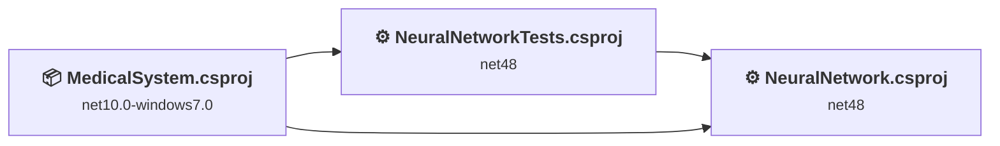
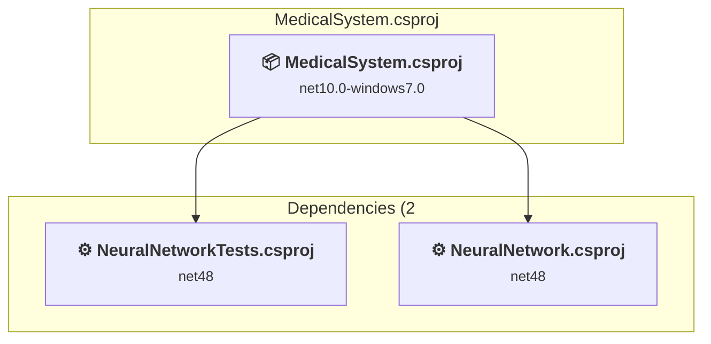
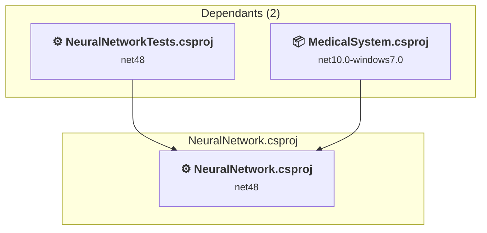
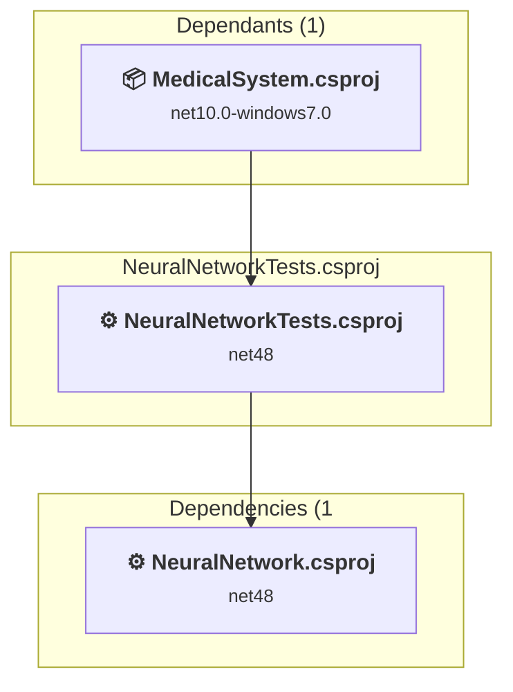

# Projects and dependencies analysis

This document provides a comprehensive overview of the projects and their dependencies in the context of upgrading to .NETCoreApp,Version=v10.0.

## Table of Contents

- [Executive Summary](#executive-Summary)
  - [Highlevel Metrics](#highlevel-metrics)
  - [Projects Compatibility](#projects-compatibility)
  - [Package Compatibility](#package-compatibility)
  - [API Compatibility](#api-compatibility)
- [Aggregate NuGet packages details](#aggregate-nuget-packages-details)
- [Top API Migration Challenges](#top-api-migration-challenges)
  - [Technologies and Features](#technologies-and-features)
  - [Most Frequent API Issues](#most-frequent-api-issues)
- [Projects Relationship Graph](#projects-relationship-graph)
- [Project Details](#project-details)

  - [MedicalSystem\MedicalSystem.csproj](#medicalsystemmedicalsystemcsproj)
  - [NeuralNetwork\NeuralNetwork.csproj](#neuralnetworkneuralnetworkcsproj)
  - [NeuralNetworkTests\NeuralNetworkTests.csproj](#neuralnetworktestsneuralnetworktestscsproj)

## Executive Summary

### Highlevel Metrics

| Metric | Count | Status |
| :--- | :---: | :--- |
| Total Projects | 3 | 2 require upgrade |
| Total NuGet Packages | 2 | All compatible |
| Total Code Files | 23 |  |
| Total Code Files with Incidents | 3 |  |
| Total Lines of Code | 2610 |  |
| Total Number of Issues | 38 |  |
| Estimated LOC to modify | 34+ | at least 1,3% of codebase |

### Projects Compatibility

| Project | Target Framework | Difficulty | Package Issues | API Issues | Est. LOC Impact | Description |
| :--- | :---: | :---: | :---: | :---: | :---: | :--- |
| [MedicalSystem\MedicalSystem.csproj](#medicalsystemmedicalsystemcsproj) | net10.0-windows7.0 | ✅ None | 0 | 0 |  | WinForms, Sdk Style = True |
| [NeuralNetwork\NeuralNetwork.csproj](#neuralnetworkneuralnetworkcsproj) | net48 | 🟢 Low | 0 | 34 | 34+ | ClassicWpf, Sdk Style = False |
| [NeuralNetworkTests\NeuralNetworkTests.csproj](#neuralnetworktestsneuralnetworktestscsproj) | net48 | 🟢 Low | 0 | 0 |  | ClassicClassLibrary, Sdk Style = False |

### Package Compatibility

| Status | Count | Percentage |
| :--- | :---: | :---: |
| ✅ Compatible | 2 | 100,0% |
| ⚠️ Incompatible | 0 | 0,0% |
| 🔄 Upgrade Recommended | 0 | 0,0% |
| ***Total NuGet Packages*** | ***2*** | ***100%*** |

### API Compatibility

| Category | Count | Impact |
| :--- | :---: | :--- |
| 🔴 Binary Incompatible | 0 | High - Require code changes |
| 🟡 Source Incompatible | 34 | Medium - Needs re-compilation and potential conflicting API error fixing |
| 🔵 Behavioral change | 0 | Low - Behavioral changes that may require testing at runtime |
| ✅ Compatible | 487 |  |
| ***Total APIs Analyzed*** | ***521*** |  |

## Aggregate NuGet packages details

| Package | Current Version | Suggested Version | Projects | Description |
| :--- | :---: | :---: | :--- | :--- |
| MSTest.TestAdapter | 2.1.1 |  | [NeuralNetworkTests.csproj](#neuralnetworktestsneuralnetworktestscsproj) | ✅Compatible |
| MSTest.TestFramework | 2.1.1 |  | [NeuralNetworkTests.csproj](#neuralnetworktestsneuralnetworktestscsproj) | ✅Compatible |

## Top API Migration Challenges

### Technologies and Features

| Technology | Issues | Percentage | Migration Path |
| :--- | :---: | :---: | :--- |
| GDI+ / System.Drawing | 34 | 100,0% | System.Drawing APIs for 2D graphics, imaging, and printing that are available via NuGet package System.Drawing.Common. Note: Not recommended for server scenarios due to Windows dependencies; consider cross-platform alternatives like SkiaSharp or ImageSharp for new code. |

### Most Frequent API Issues

| API | Count | Percentage | Category |
| :--- | :---: | :---: | :--- |
| P:System.Drawing.Image.Width | 3 | 8,8% | Source Incompatible |
| P:System.Drawing.Image.Height | 3 | 8,8% | Source Incompatible |
| T:System.Drawing.Bitmap | 3 | 8,8% | Source Incompatible |
| T:System.Drawing.Drawing2D.PixelOffsetMode | 3 | 8,8% | Source Incompatible |
| T:System.Drawing.Drawing2D.SmoothingMode | 3 | 8,8% | Source Incompatible |
| T:System.Drawing.Drawing2D.InterpolationMode | 3 | 8,8% | Source Incompatible |
| M:System.Drawing.Bitmap.#ctor(System.Int32,System.Int32) | 2 | 5,9% | Source Incompatible |
| T:System.Drawing.Graphics | 2 | 5,9% | Source Incompatible |
| M:System.Drawing.Image.Save(System.String) | 1 | 2,9% | Source Incompatible |
| M:System.Drawing.Bitmap.SetPixel(System.Int32,System.Int32,System.Drawing.Color) | 1 | 2,9% | Source Incompatible |
| M:System.Drawing.Bitmap.GetPixel(System.Int32,System.Int32) | 1 | 2,9% | Source Incompatible |
| M:System.Drawing.Graphics.DrawImage(System.Drawing.Image,System.Int32,System.Int32,System.Int32,System.Int32) | 1 | 2,9% | Source Incompatible |
| F:System.Drawing.Drawing2D.PixelOffsetMode.HighQuality | 1 | 2,9% | Source Incompatible |
| P:System.Drawing.Graphics.PixelOffsetMode | 1 | 2,9% | Source Incompatible |
| F:System.Drawing.Drawing2D.SmoothingMode.HighQuality | 1 | 2,9% | Source Incompatible |
| P:System.Drawing.Graphics.SmoothingMode | 1 | 2,9% | Source Incompatible |
| F:System.Drawing.Drawing2D.InterpolationMode.HighQualityBicubic | 1 | 2,9% | Source Incompatible |
| P:System.Drawing.Graphics.InterpolationMode | 1 | 2,9% | Source Incompatible |
| M:System.Drawing.Graphics.FromImage(System.Drawing.Image) | 1 | 2,9% | Source Incompatible |
| M:System.Drawing.Bitmap.#ctor(System.String) | 1 | 2,9% | Source Incompatible |

## Projects Relationship Graph

Legend:
📦 SDK-style project
⚙️ Classic project

## Project Details

### MedicalSystem\MedicalSystem.csproj

#### Project Info

- **Current Target Framework:** net10.0-windows7.0✅
- **SDK-style**: True
- **Project Kind:** WinForms
- **Dependencies**: 2
- **Dependants**: 0
- **Number of Files**: 17
- **Lines of Code**: 1749
- **Estimated LOC to modify**: 0+ (at least 0,0% of the project)

#### Dependency Graph

Legend:
📦 SDK-style project
⚙️ Classic project

### API Compatibility

| Category | Count | Impact |
| :--- | :---: | :--- |
| 🔴 Binary Incompatible | 0 | High - Require code changes |
| 🟡 Source Incompatible | 0 | Medium - Needs re-compilation and potential conflicting API error fixing |
| 🔵 Behavioral change | 0 | Low - Behavioral changes that may require testing at runtime |
| ✅ Compatible | 0 |  |
| ***Total APIs Analyzed*** | ***0*** |  |

### NeuralNetwork\NeuralNetwork.csproj

#### Project Info

- **Current Target Framework:** net48
- **Proposed Target Framework:** net10.0-windows
- **SDK-style**: False
- **Project Kind:** ClassicWpf
- **Dependencies**: 0
- **Dependants**: 2
- **Number of Files**: 8
- **Number of Files with Incidents**: 2
- **Lines of Code**: 615
- **Estimated LOC to modify**: 34+ (at least 5,5% of the project)

#### Dependency Graph

Legend:
📦 SDK-style project
⚙️ Classic project

### API Compatibility

| Category | Count | Impact |
| :--- | :---: | :--- |
| 🔴 Binary Incompatible | 0 | High - Require code changes |
| 🟡 Source Incompatible | 34 | Medium - Needs re-compilation and potential conflicting API error fixing |
| 🔵 Behavioral change | 0 | Low - Behavioral changes that may require testing at runtime |
| ✅ Compatible | 487 |  |
| ***Total APIs Analyzed*** | ***521*** |  |

#### Project Technologies and Features

| Technology | Issues | Percentage | Migration Path |
| :--- | :---: | :---: | :--- |
| GDI+ / System.Drawing | 34 | 100,0% | System.Drawing APIs for 2D graphics, imaging, and printing that are available via NuGet package System.Drawing.Common. Note: Not recommended for server scenarios due to Windows dependencies; consider cross-platform alternatives like SkiaSharp or ImageSharp for new code. |

### NeuralNetworkTests\NeuralNetworkTests.csproj

#### Project Info

- **Current Target Framework:** net48
- **Proposed Target Framework:** net10.0
- **SDK-style**: False
- **Project Kind:** ClassicClassLibrary
- **Dependencies**: 1
- **Dependants**: 1
- **Number of Files**: 1016
- **Number of Files with Incidents**: 1
- **Lines of Code**: 246
- **Estimated LOC to modify**: 0+ (at least 0,0% of the project)

#### Dependency Graph

Legend:
📦 SDK-style project
⚙️ Classic project

### API Compatibility

| Category | Count | Impact |
| :--- | :---: | :--- |
| 🔴 Binary Incompatible | 0 | High - Require code changes |
| 🟡 Source Incompatible | 0 | Medium - Needs re-compilation and potential conflicting API error fixing |
| 🔵 Behavioral change | 0 | Low - Behavioral changes that may require testing at runtime |
| ✅ Compatible | 0 |  |
| ***Total APIs Analyzed*** | ***0*** |  |

